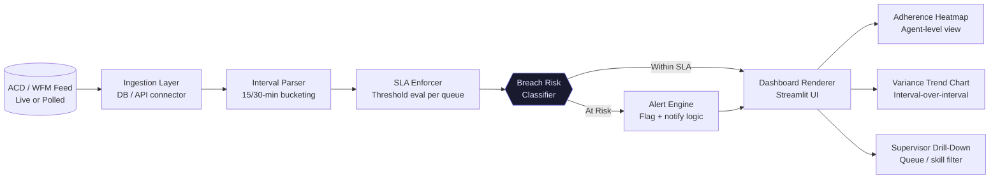

# RTA Command Center
> Real-time adherence and SLA enforcement dashboard built on Streamlit/Python,
> eliminating manual daily reporting and delivering live interval-level variance
> visibility to operations teams.


---

## Executive Summary

Operations teams were spending 2–3 hours daily manually compiling adherence
reports from WFM exports and ACD data — with a reporting lag of 3–4 hours
rendering the data operationally useless. The RTA Command Center replaces this
entirely with a live Streamlit dashboard that ingests real-time ACD/WFM feeds,
computes interval-level SLA variance, and surfaces breach-risk alerts before
SLAs are missed. Manual reporting overhead was eliminated on day one of
deployment.

---

## Business Impact

| Metric                        | Baseline           | Post-Deployment    | Delta           |
|-------------------------------|--------------------|--------------------|-----------------|
| Daily Reporting Build Time    | 2–3 hrs manual     | 0 hrs (automated)  | ↓ 100%          |
| Data Freshness / Lag          | 3–4 hr delay       | <5 min refresh     | ↓ 97%           |
| SLA Breach Detection Lead Time| Reactive (post-breach)| Predictive (pre-breach)| +30–45 min window |
| Supervisor Escalation Accuracy| Anecdotal          | Data-driven alerts | Quantified      |

---

## Architecture Overview



---

## Tech Stack Justification

| Component          | Technology         | Rationale                                                                  |
|--------------------|--------------------|----------------------------------------------------------------------------|
| Dashboard Layer    | Streamlit          | Zero-frontend-overhead Python-native UI; ops teams consume it in-browser with no install; fast iteration cycle vs. Dash or custom Flask |
| Data Engine        | Pandas / SQLAlchemy| Interval aggregation + live DB queries; SQLAlchemy abstracts DB vendor lock-in |
| SLA Logic          | Python (pure)      | Business rules encoded explicitly — no black-box ML; transparent and auditable by ops leadership |
| Alert Engine       | SMTP / Webhook     | Dual-channel: email escalation + Slack/Teams webhook for floor supervisors |
| Config Management  | YAML               | Threshold values (SLA targets, breach sensitivity) externalized; no redeployment required for tuning |

---

## Repository Structure
rta-command-center/
├── src/
│   ├── app.py              # Streamlit entry point; layout and routing
│   ├── sla_enforcer.py     # Threshold evaluation logic per queue/interval
│   ├── alert_engine.py     # Breach classification, SMTP, webhook dispatch
│   └── db_connector.py     # SQLAlchemy session management and query layer
├── config/
│   └── thresholds.yaml     # SLA targets, refresh intervals, alert sensitivity
├── docs/
│   └── deployment_guide.md # Environment setup, DB permissions, alert config
└── README.md

---

## Deployment

### Prerequisites
- Python 3.11+
- Streamlit 1.35+
- Live ACD/WFM database access (read-only) or polling feed endpoint
- SMTP credentials or webhook URL for alerting

### Local Setup
```bash
git clone https://github.com/[username]/rta-command-center.git
cd rta-command-center
pip install -r requirements.txt
cp config/.env.example config/.env   # populate DB + alert credentials
```

### Run
```bash
streamlit run src/app.py
```

### Environment Variables
| Variable          | Description                              |
|-------------------|------------------------------------------|
| `DB_HOST`         | ACD/WFM source database host             |
| `DB_NAME`         | Source database name                     |
| `DB_USER`         | Read-only DB credentials                 |
| `SMTP_HOST`       | Mail relay host for breach alerts        |
| `ALERT_WEBHOOK`   | Slack or Teams incoming webhook URL      |
| `REFRESH_SECONDS` | Dashboard polling interval (default: 300)|

---

## Roadmap

- [x] Live SLA enforcer with configurable thresholds
- [x] Adherence heatmap by agent/interval
- [x] SMTP + webhook dual-channel alerting
- [ ] Predictive breach scoring (Erlang C integration with WFM Engine)
- [ ] Role-based access (supervisor vs. analyst views)
- [ ] Historical trend module (rolling 4-week adherence)

---

## Author

**Hatem [Last Name]** — Operations Architect & Automation Engineer  
[LinkedIn](#) · [Portfolio](#) · [Email](#)
