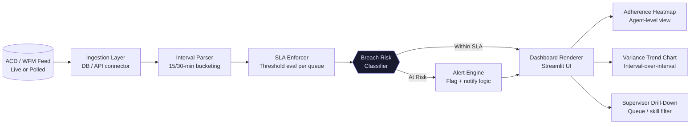

# RTA Command Center

> Real-time adherence and SLA enforcement dashboard built on Streamlit/Python, eliminating manual daily reporting and delivering live interval-level variance visibility to operations teams.

---

## Executive Summary

Operations teams were spending 2–3 hours daily manually compiling adherence reports from WFM exports and ACD data — with a reporting lag of 3–4 hours rendering the data operationally useless. The RTA Command Center replaces this entirely with a live Streamlit dashboard that ingests real-time ACD/WFM feeds, computes interval-level SLA variance, and surfaces breach-risk alerts before SLAs are missed. Manual reporting overhead was eliminated on day one of deployment.

---

## Business Impact

| Metric | Baseline | Post-Deployment | Delta |
| --- | --- | --- | --- |
| Daily Reporting Build Time | 2–3 hrs manual | 0 hrs (automated) | ↓ 100% |
| Data Freshness / Lag | 3–4 hr delay | <5 min refresh | ↓ 97% |
| SLA Breach Detection | Reactive | Predictive | +30–45 min window |
| Supervisor Escalation | Anecdotal | Data-driven alerts | Quantified |

---

## Architecture Overview

## Tech Stack Justification

| Component | Technology | Rationale |
| --- | --- | --- |
| **Dashboard Layer** | Streamlit | Zero-frontend-overhead Python-native UI; ops teams consume it in-browser with no install |
| **Data Engine** | Pandas / SQLAlchemy | Interval aggregation + live DB queries |
| **SLA Logic** | Python (pure) | Business rules encoded explicitly — transparent and auditable |
| **Alert Engine** | SMTP / Webhook | Dual-channel: email escalation + Slack/Teams webhook |
| **Config Management** | YAML | Threshold values (SLA targets) externalized; no redeployment required |

---

## Deployment

### Prerequisites

* Python 3.11+
* Streamlit 1.35+

### Local Setup

git clone [https://github.com/ThommyShelby79/rta-command-center.git](https://github.com/ThommyShelby79/rta-command-center.git)
cd rta-command-center
pip install -r requirements.txt

### Run

streamlit run src/app.py

---

## Author

**Hatem Shalaby** — Operations Architect & Automation Engineer
[LinkedIn](https://www.google.com/search?q=https://www.linkedin.com/in/hatem-shalaby-7359611a2) · [Portfolio](https://www.google.com/search?q=https://hatemismail2011shalaby.github.io/RTA-Operations-Portfolio/) · [Email]()

## Run Instructions
Always run from the src directory to avoid path conflicts:
`streamlit run src/app.py`
